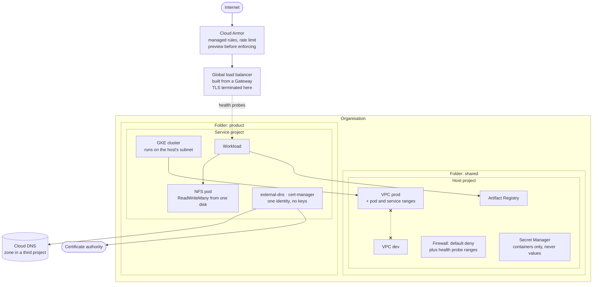

# Platform Blueprints

Reference implementations and architecture decisions from building and running
the technology platform of two operating businesses on Google Cloud.

This is not a tutorial collection. Each piece here answers a question I had to
answer with money and uptime on the line, and the reasoning is included because
the reasoning is the part that transfers.

---

## Why this exists

Most infrastructure examples show you the happy path and stop. They rarely say
what the decision cost, what it ruled out, or what you should do instead when
your constraints differ. That gap is where the expensive mistakes live.

So every section here carries the same three things:

- **What it does**: the working implementation.
- **Why it is built this way**: the decision and the alternative it beat.
- **What it costs**: the trade-off you are accepting.

---

## How the pieces fit

An editable version is in [`docs/diagrams/`](docs/diagrams/). Every element
below was applied to a real organisation and then destroyed.



The crossed line between the two networks is the point of ADR 4: they are not
peered, so there is no route to permit or deny. The dashed probe path is what
the default-deny firewall blocked, which took a working application and made it
return 503 to everyone.

## Contents

### `patterns/llm-ports`

Provider-agnostic access to language models through ports and adapters.

The application depends on a protocol, never on a vendor. Swapping providers is
a new adapter and a config change, not a rewrite. An in-memory adapter lets the
entire system be exercised in tests without a network, which is why the suite
runs in under a tenth of a second and never fails because someone else's API
had a bad afternoon.

```
49 tests offline, no sockets opened
mypy --strict, clean
5 contract tests against a real provider
```

The offline suite was green while seven defects sat in the adapter. The first
live call found all of them. Both the defects and what they taught are written
down rather than quietly fixed.

→ [Read it](patterns/llm-ports/)

### `landing-zone`

The organisation layout a platform sits on: folder hierarchy, a Shared VPC host
with two physically isolated networks, and one project per product per
environment.

The environments are separate networks rather than subnets of one, and they are
not peered. There is no route between production and development to permit or
deny. That costs real money, anything shared has to be built twice, and it
buys isolation that survives someone editing a firewall rule.

Access is assigned to groups rather than people, because access has to end when
someone leaves and that must be one action in one place. Constraints are applied
before any of it, because a grant made while they were absent was never checked
against them.

```
terraform fmt -check -recursive .
terraform validate            valid
provider lock                 linux_amd64, darwin_arm64, darwin_amd64
refused at plan time          primitive roles, an applier that can change IAM,
                              a domain name where a customer ID belongs
applied and destroyed         twice, against a real organisation; the second
                              run carried a cluster on the shared network and
                              a workload pulling from the org's own registry
```

→ [Read it](landing-zone/)

### `platform/vaultwarden`

A password manager, deployed the way one has to be. Every other service here
can be rebuilt from backup if it breaks; this one holds the credentials to
everything else, so a mistake is a breach rather than an outage.

The admin panel is disabled rather than protected, because the token that
guards it is a password with no second factor and no lockout. The backup goes
through SQLite's own `.backup` rather than through the filesystem, because a
copy taken while the server runs is valid often enough to be trusted and
corrupt often enough to matter. And a second script restores that backup and
checks it, because a backup that has never been restored is a belief.

Built twice, for Kubernetes and for Cloud Run, because the platform decides the
failure mode. Cloud Run can mount a bucket, so persistence is not the problem ,
file locking is. SQLite on a mounted bucket runs, capped at one instance
forever. And the signing key has to leave the container's own filesystem, or
every new instance generates its own and users are logged out at random.

```
kubectl apply --dry-run    valid
terraform validate         valid
restore verification       rejects a torn database, an empty one,
                           a missing signing key and a truncated archive
not verified               neither variant has been deployed to a cluster
```

→ [Read it](platform/vaultwarden/)

### `platform/n8n`

Workflow automation on Kubernetes: all state in Postgres, three entrances with
three different locks, and an encryption key whose loss costs every stored
credential even with a perfect database backup.

The section exists for one argument. Everything about this workload says it
belongs on the cheapest interruptible capacity available, no volume, no local
state, restarts are free. That is right about restarts and wrong about
executions: an eviction mid-run does not roll anything back, it leaves the work
half done and records it as crashed.

```
deployed to a disposable cluster    all pods ready, 0 restarts
health probe                        200 on all three services
schema                              30 tables created
credentials at rest                 ciphertext; the plaintext appears nowhere
```

Deploying it found a defect that `--dry-run` reports as valid: the service exits
instead of retrying when the database is not up yet, so it crash-looped twice
before settling. Harmless, and it makes every restart alarm fire on every
deploy. An init container fixes it.

→ [Read it](platform/n8n/)

### `platform/erpnext`

An ERP deployed with the upstream Helm chart, which is the correct way to
install it and the reason the interesting decisions are all about what the
chart leaves to you.

The section exists for one idea. The framework installs into a **bench**: one
copy of the code and one runtime, with many sites sharing it. A site has its
own database and its own data, so it looks like a tenant boundary, and for
anything version-shaped it is not one. Upgrading the image upgrades the code
under every site at once, and adding an application for one site changes the
bench all of them run on.

The blast radius is the bench, not the site. ADR 13.

→ [Read it](platform/erpnext/)

---

## What each part is, and is not

Written plainly, because a reader deciding whether to use any of this deserves
to know where it stops.

**`patterns/llm-ports`**: a small Python package showing how to depend on a
port rather than on a provider, with a contract test that runs against a real
one. Take the shape and the tests. It is not a client library: one adapter, no
streaming, no tool calling, and ADR 3 explains why those do not belong behind
the same port.

**`landing-zone`**: five Terraform modules, hierarchy, two isolated networks,
a project per environment, group-based access, and policy constraints. Enough
to stand up the shell of an organisation. It has been applied once to a real
organisation and destroyed, and Shared VPC attachment specifically was never
reached. There is no compute, no pipeline, no logging destination, no registry
and no outbound gateway. It is a floor plan, not a building.

**`platform/vaultwarden`**: a password manager for Cloud Run, with the
Kubernetes variant kept for the comparison. The backup and restore scripts work
and were exercised against a database built for the purpose, not against a
running instance. Neither deployment has been run end to end.

**`platform/n8n`**: the only section deployed to a cluster, exercised and torn
down. Take it and it will come up. It has no gateway, no certificate, and no
backup for its database, which sits oddly beside ADR 7 in this same repository
and is named here rather than left to be noticed.

**`platform/erpnext`**: Helm values for the upstream chart with the choices
that cost something annotated, a persistent DNS zone, and the reasoning about
benches. Not deployed from this repository yet, and it says so.

**`docs/decisions`**: twenty-four decisions, each with what was rejected and what
it costs. This is the part with the longest useful life. The code will age.

**`.github/workflows`**: checks that run without credentials, which is exactly
their limit. They catch a stray secret, a broken link, a real hostname, an
unformatted file. They pass every defect that applying this to a real
organisation found.

### The honest summary

A competent engineer could take any section and have something running the same
day. Nobody should take any of it and put it in front of customers without
reading the decision that goes with it, because the decisions are where the
costs are written, and every one of them costs something.

## Ground rules

Each of these is checked on every push. A rule nobody checks is a preference.

**Nothing here is copied from a live environment.** No project identifiers, no
organisation or billing identifiers, no domains, no client names. Every example
value is fictional and every credential is a placeholder.

**Secrets never reach the repository.** `.gitignore` was the first commit, the
history is scanned before every push, and configuration is expected to come from
a secret manager, not from a file.

**Comments and documentation are in English.** The code is meant to be read by
people who did not write it.

---

## Decisions

Architecture decisions live in [`docs/decisions/`](docs/decisions/). They are
short, dated, and state what was rejected as well as what was chosen.

1. [Depend on a port, not on a provider](docs/decisions/0001-depend-on-a-port-not-a-provider.md)
2. [Tests must not touch the network](docs/decisions/0002-tests-must-not-touch-the-network.md)
3. [Segregate the ports instead of widening one](docs/decisions/0003-segregated-ports-for-advanced-capabilities.md)
4. [Separate networks per environment, not one network with rules](docs/decisions/0004-isolated-networks-instead-of-one-with-rules.md)
5. [No service account keys](docs/decisions/0005-no-service-account-keys.md)
6. [The password manager's admin panel is disabled, not protected](docs/decisions/0006-no-admin-panel.md)
7. [Backups are verified by restoring them, on a schedule](docs/decisions/0007-backups-verified-by-restoring-them.md)
8. [Stateless is not the same as interruptible](docs/decisions/0008-stateless-is-not-interruptible.md)
9. [One workload, several entrances with different locks](docs/decisions/0009-one-workload-several-doors.md)
10. [Bindings go to groups, never to people](docs/decisions/0010-bindings-go-to-groups.md)
11. [A constraint is not a role](docs/decisions/0011-a-constraint-is-not-a-role.md)
12. [The images a cluster runs come from a registry we control](docs/decisions/0012-images-come-from-our-own-registry.md)
13. [The blast radius is the bench, not the site](docs/decisions/0013-the-blast-radius-is-the-bench.md)
14. [What logs cost is decided at ingestion, not at deletion](docs/decisions/0014-log-retention-is-decided-at-ingestion.md)
15. [One access matrix, applied to every system](docs/decisions/0015-one-access-matrix-applied-everywhere.md)
16. [Internal tools are protected by identity, not network position](docs/decisions/0016-identity-aware-access-not-a-network-perimeter.md)
17. [How a serverless workload reaches a private service](docs/decisions/0017-how-serverless-workloads-reach-private-services.md)
18. [Billing detail is exported on the first day](docs/decisions/0018-billing-export-is-not-retroactive.md)
19. [A second factor on every account](docs/decisions/0019-a-second-factor-on-every-account.md)
20. [A managed application firewall in front of anything public](docs/decisions/0020-a-managed-firewall-in-front-of-public-services.md)
21. [The security posture service is read on a schedule](docs/decisions/0021-security-posture-is-read-on-a-schedule.md)
22. [Secrets are referenced, never passed through a deployment tool](docs/decisions/0022-secrets-are-referenced-never-passed.md)
23. [The foundation is built first, because it is the thing that gets built last](docs/decisions/0023-the-foundation-is-built-first.md)
24. [What development proves is that it works in development](docs/decisions/0024-development-proves-it-works-in-development.md)

---

## About

Built by **Diego Hatun**.

[linkedin.com/in/dhatun](https://www.linkedin.com/in/dhatun)

Licensed under [MIT](LICENSE).
