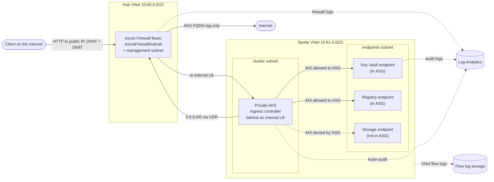

# Azure Landing Zone

A laboratory landing zone for one private workload on Azure, deployed from
this README and verified against a real subscription by nine scripts: hub and
spoke networking with deny-by-default segmentation, an egress firewall, a
private AKS cluster, a private registry, a vault and an object repository
reachable only through private endpoints, workload identity with no stored
secrets, and a subscription policy against public network interfaces. A
permanent platform layer costs about fifteen dollars a month; an ephemeral
workload layer bills by the
hour only while a session is up.

Each decision in [`docs/decisions/`](docs/decisions/) records what it beat and
what it costs.

## What this is, and what it is not

**It is** a laboratory landing zone for one workload in one subscription,
built to be deployed by someone else and to show, against Azure rather than by
assertion, what each control in the data path does. The nine checks prove:
no egress to the internet except the declared destinations, no public address
on the cluster, a secret read by workload identity and refused to the node's
identity, private resolution of the vault, registry and storage, a push and a
pull through the private registry, egress decisions recorded in the firewall's
own log, a policy refusing a public address on a network interface,
segmentation between two private endpoints in the same subnet, and what the
firewall does to inbound traffic.

**It is not** Microsoft's enterprise-scale Azure landing zone: no management
group hierarchy, no separate platform subscriptions, no Defender for Cloud.
docs/decisions/0013 explains why and maps each piece. A real organization
should start from Microsoft's landing zone and use this to understand and test
what the pieces inside one spoke do.

## Limitations

- **Applied but not exercised by a check:** storage versioning, soft delete
  and lifecycle, vault purge protection, the allowed-locations policy, the
  firewall's DNAT rule on 443, VNet flow logs, the audit log settings and
  the budget alert.
- **Egress is narrow, not closed:** the spoke may reach the destinations in
  Microsoft's `AzureKubernetesService` FQDN tag, which the cluster needs, and
  nothing else. Check 1 proves the refusal for one arbitrary host, not for
  every destination.
- **The policy covers standalone network interfaces only;** it does not
  inspect scale-set NICs or load balancer public addresses. The cluster's
  nodes are kept private by the cluster's own setting, which check 3 verifies.
- **One storage account keeps shared keys:** the one receiving VNet flow
  logs, which the flow log service writes with the account key
  (docs/decisions/0004).
- **The pod network rules are not exercised by a check.** The pod to pod
  rule was verified once, live, by scaling the cluster to two nodes and
  running all nine checks; the node to pod rule follows Microsoft's guidance
  for CNI Overlay behind a network security group and was not part of that
  run. The checks themselves run on the single node the lab uses.
- **The vault accepts one public address**, the operator's, declared in
  `vault_operator_ip_rules`, because Terraform writes a secret from the
  operator's machine. The registry refuses public network access but keeps
  Azure's default bypass for trusted Azure services.
- **No pipeline:** every apply runs from the operator's machine.
- **No high availability:** one node, one firewall instance, locally
  redundant storage (docs/decisions/0002).
- **No HTTPS, WAF or global edge:** traffic enters over plain HTTP through the
  firewall, enough to prove the path, not to serve users (docs/decisions/0012).
- **No Kubernetes network policies:** the cluster runs Cilium with network
  policy enabled, but declares no NetworkPolicy objects, so segmentation stops
  at the subnet.
- **Two wiring mistakes the tests cannot see:** a spoke DNS link pointing at
  the hub, or the vault or identity created in the hub's resource group, both
  still test green; both show up in the first real plan.

## What exists

Thirteen modules and three stacks.

Permanent platform (`live/00-bootstrap`, `live/lab/10-platform`), applied once
and kept between sessions:

- `modules/naming`: the naming and tagging contract every other module consumes
- `modules/network-hub`: the hub and the two subnets the firewall requires
- `modules/network-spoke`: the spoke with two subnets, `cluster` and
  `endpoints`, each with its own NSG and an explicit deny that overrides
  Azure's permissive intra-network default
- `modules/private-dns`: the private zones, linked to both networks
- `modules/identity`: the workload's managed identity
- `modules/keyvault`: RBAC authorization, purge protection, public network
  closed except the operator's declared address, audit logs to the workspace
- `modules/storage`: versioning, soft delete and lifecycle; archive tiering
  only where the replication type supports it
- `modules/policy`: Microsoft built-ins assigned at the subscription
- `modules/observability`: the Log Analytics workspace
- `modules/private-endpoint`: private link with its DNS record and optional
  application security group membership
- An application security group for the endpoints the cluster may reach,
  VNet flow logs on the spoke, and an optional monthly budget alert
  (`budget_amount`, `budget_contact_emails`)
- `live/00-bootstrap`: the storage account the other stacks keep their state
  in, reached with Entra ID only

Ephemeral workload (`live/lab/20-workload`), created and destroyed per session
by `scripts/session-up.sh` and `scripts/session-down.sh`:

- `modules/firewall`: the Basic tier, egress from the spoke only, one DNAT
  path in (docs/decisions/0010)
- `modules/aks`: private cluster, Entra integration with Azure RBAC and no
  local accounts, workload identity, Cilium, automatic patch and node image
  upgrades in a weekly window, a user-assigned control plane identity with
  `Network Contributor` on its subnet and route table only
  (docs/decisions/0011)
- `modules/acr`: Premium registry, no admin account, public network disabled
- the registry's private endpoint, the ingress controller behind an internal
  load balancer, firewall and cluster audit logs to the workspace

## Deploying it

### Before you start

- Terraform 1.9 or newer, Azure CLI, and Python 3 with PyYAML (used to render
  the ingress manifest). `kubectl` is not needed locally: every cluster
  command runs through `az aks command invoke`.
- `az login` as a user with Owner on the target subscription. Every stack
  authenticates as you; there is no service principal and no stored secret.
- At least four regional vCPUs of quota in the region you choose. A trial
  subscription has exactly four. The cluster uses two.
- Some SKUs are restricted per subscription and region, and no query tells you
  in advance. If the firewall or the node size is refused with
  `SkuNotAvailable`, choose another region before changing the design.
- Your public address, because the vault's data plane only admits the operator
  (`curl -s https://ifconfig.me`). If it changes between sessions, update it in
  `live/lab/10-platform/terraform.tfvars` and apply the platform again.

### Once

1. **State storage.** `live/00-bootstrap`: copy `terraform.tfvars.example` to
   `terraform.tfvars`, fill it in, then `terraform init && terraform apply`.
   Its own state stays local on purpose; keep that file. Note the three
   outputs. It grants you the data role on the account it creates; wait a few
   minutes for that role to propagate before the next step.
2. **Permanent platform.** `live/lab/10-platform`: fill in `terraform.tfvars`
   (same prefix, workload and region, plus your address in
   `vault_operator_ip_rules`) and `backend.hcl` (the bootstrap outputs), then
   `terraform init -backend-config=backend.hcl && terraform apply`.

### Every working session

3. **Ephemeral workload.** `live/lab/20-workload`: fill in `terraform.tfvars`
   and `backend.hcl` once, `terraform init -backend-config=backend.hcl` once,
   then start each session with `./scripts/session-up.sh`. It applies the
   layer, imports the two helper images the checks need into the private
   registry, waits for the cluster, and installs the ingress controller
   behind the firewall from images copied into the private registry.
4. **Verify.** `./scripts/verify/run-all.sh` runs the nine checks and writes
   their output to `docs/evidence/<date>/`.
5. **Tear down.** `./scripts/session-down.sh` destroys the ephemeral layer
   only. Do not skip it: the firewall bills by the hour whether or not
   anything uses it.

## How it is verified

Two layers, and it matters which one proves what.

`terraform test` against a mocked provider runs a real plan against the
provider schema with no credentials and no cloud:

    ./scripts/verify-tree.sh

That proves the configuration is internally consistent, the provider accepts
the shapes, and the assertions bite when the thing they guard is broken. It
cannot prove anything only the Azure API knows: subscription state, the
permission model, quota, or rules that only apply to a combination of
settings.

Those are covered by nine scripts in `scripts/verify/`, run against the live
lab with `scripts/verify/run-all.sh`:

1. **Egress.** A pod reaches an allowed destination and is refused an
   arbitrary internet host. It tries one host, not the whole internet.
2. **Private resolution.** The registry, the vault and the object repository
   resolve to addresses inside the spoke.
3. **No public address.** The control plane has only a private name, no node
   scale set carries a public IP configuration, and the node resource group
   holds no public IP.
4. **Identity.** A pod with the workload identity reads the secret, compared
   by hash with the value in the vault; a pod using the node's kubelet
   identity is refused by the vault.
5. **Private registry.** A job pushes an image through the private endpoint
   with the workload identity, and a pod pulls it with no pull secret.
6. **Firewall log.** The firewall's own application rule log records this
   check's allowed and refused requests, and only records written after it
   started count.
7. **Policy.** Attaching a public address to a network interface is refused
   by this deployment's own policy assignment.
8. **Segmentation.** From the cluster, the vault endpoint answers on 443 and
   the storage endpoint in the same subnet does not; the only difference
   between them is membership of the application security group.
9. **Inbound path.** A request from the internet reaches the ingress through
   the firewall, and the ingress logs an address of the firewall subnet as
   the caller, never the client (docs/decisions/0012).

Every check also fails, rather than passes, when its probe produced no result
at all.

The output of the last full run, deployed from a clean copy by following
"Deploying it" to the letter, is in [`docs/verified/`](docs/verified/): the
nine transcripts as the scripts printed them, with subscription, tenant and
object identifiers replaced by placeholders. Raw output of your own runs lands
in `docs/evidence/`, which is git ignored because it carries real identifiers.

## Cost

The permanent layer costs about fifteen dollars a month, almost all of it the
two private endpoints (vault and object repository, $0.01/h each), plus a few
cents of storage, flow logs and log ingestion. It stays up between sessions so
nobody pays for rebuilding it.

The ephemeral layer is a real firewall, a real cluster node and a real
Premium registry, all billing by the hour. Catalogue prices for `eastus2`,
verified 2026-09-25 (docs/decisions/0010 for the firewall, 0011 for the node).
Private endpoints and public
addresses add a few cents more:

| Component | USD/hour |
| --- | --- |
| Azure Firewall Basic, deployment | 0.3950 |
| AKS node, `Standard_D2als_v7` | 0.0804 |
| ACR Premium | 0.0694 |
| AKS control plane, Free tier | 0 |
| **Total** | **~0.54** |

A four-hour session is a little over two dollars, about three quarters of it
the firewall.
`scripts/session-up.sh` starts the clock; `scripts/session-down.sh` stops it
by destroying the ephemeral layer only. A session left up is the most
expensive mistake this design allows.

Components with a high fixed monthly floor, such as a managed global edge, a
premium API gateway, a premium firewall tier or a DDoS protection plan, are
not built here, and pricing a stack that does not exist is a claim this
repository does not make.
